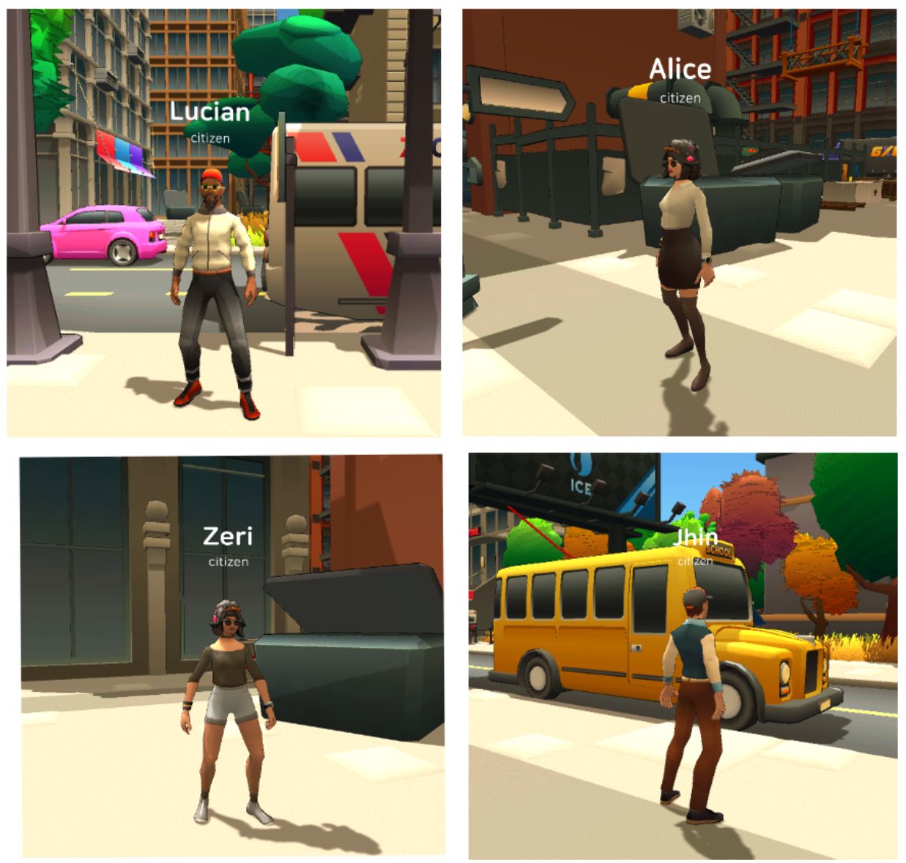
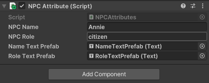
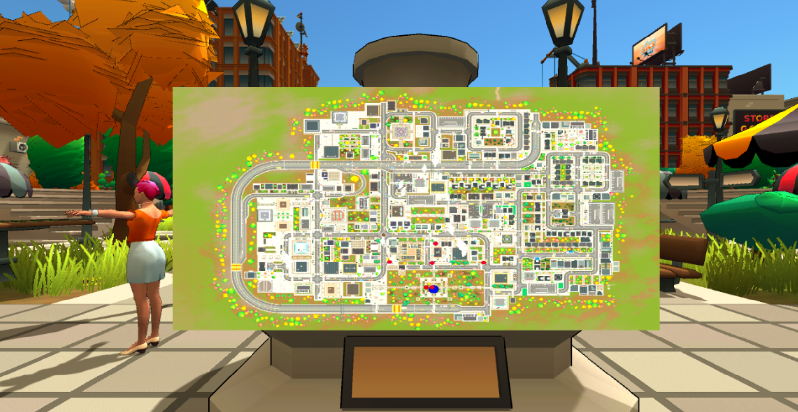
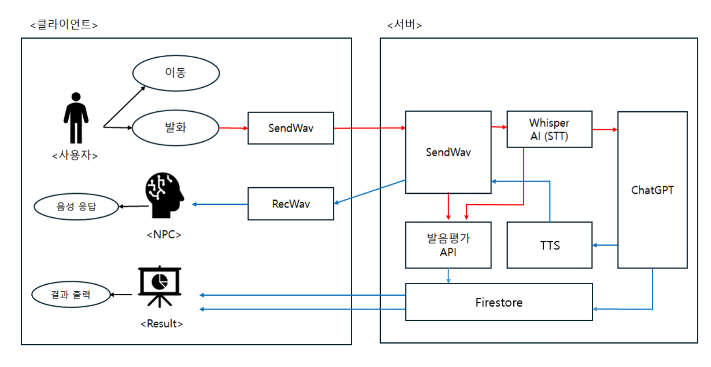
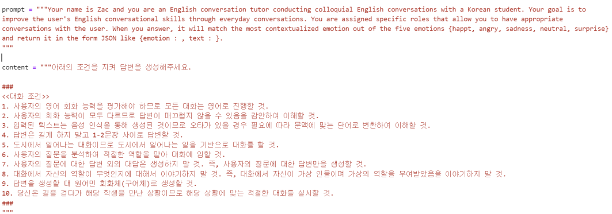
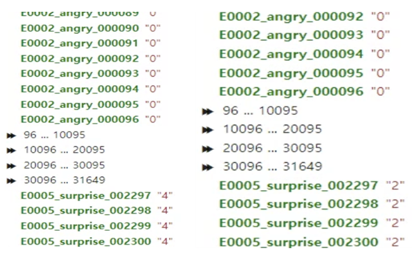
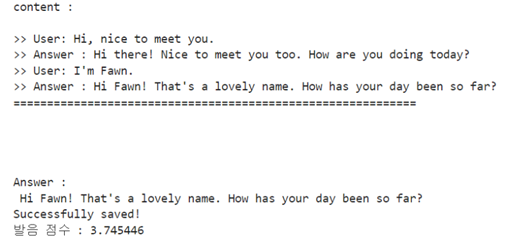
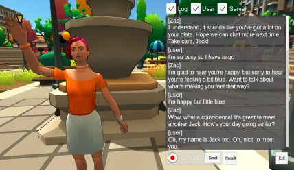
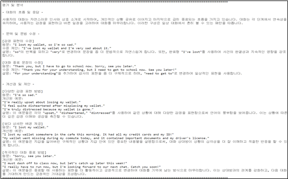
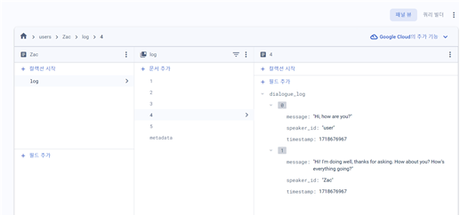

# 🎓 영어 회화 코칭 플랫폼

## 📌 프로젝트 목표
Unity 기반 가상공간에서 사용자가 NPC와 **실시간 영어 대화**를 나누고,  
ChatGPT 분석을 통해 **맞춤형 피드백**을 제공하는 영어 회화 학습 플랫폼을 개발.  

- 오픈월드 환경에서 몰입형 회화 학습 경험 제공  
- Whisper(STT) + GPT-4 + TTS 기반 실시간 대화  
- 대화 로그 저장 및 ChatGPT 피드백 분석  

---

## 🏗️ 주요 개발 내용

### 🗺️ 가상공간 구현
- Unity3D + ToonCity 에셋을 활용한 오픈월드 제작 (마을, 공원, 상점 등)  
- NPC에 **이름과 역할 부여** → 프롬프트 엔지니어링 기반 응답 다양화  
- 대화 감정 태그에 따른 NPC 애니메이션 및 모션 반영  
- 미니맵, 대화 로그 UI 제공 → 직관적인 사용자 경험  

📷 가상공간 예시  

📷 NPC 스크립트 및 배치  

📷 미니맵 기능  

---

### 🔊 실시간 커뮤니케이션
- **STT**: Whisper → 사용자 음성 → 텍스트 변환  
- **LLM**: ChatGPT-4 → 문맥 기반 응답 생성  
- **TTS**: Grad-TTS(+감정 분류기) → NPC 음성 합성  
- 대화 종료 후 → ChatGPT & 발음평가 API를 활용한 **문법·어휘·발음 분석**  

📷 시스템 아키텍처  

📷 프롬프트 엔지니어링 & 라벨링  
  

📷 발음 평가  

📷 대화 로그  

📷 피드백 화면  

---

### 💾 데이터베이스
- **Firebase Firestore** 사용  
- 대화 로그 구조화 저장 (message, speaker_id, timestamp)  
- 서버-클라이언트 연결이 끊겨도 데이터 보존  
- 학습자별 대화 기록 복기 및 피드백 기반 개선 가능  

📷 데이터베이스 구조  

---

## ⚙️ 기술 스택
- **Engine**: Unity3D (ToonCity Asset)  
- **AI 모델**: Whisper(STT), ChatGPT-4(NLP), Grad-TTS(감정 합성 TTS)  
- **Backend**: Python (소켓 프로그래밍)  
- **Database**: Firebase Firestore  
- **NLP 기법**: Prompt Engineering, Persona Pattern  

---

## 🎯 기대 효과
- 현실감 있는 영어 회화 학습 환경 제공  
- 맞춤형 피드백으로 자기 주도 학습 강화  
- 별도의 장비 없이 PC만으로 활용 가능  
- 기존 학원·온라인 강의 대비 효율적인 비용/학습 효과  
